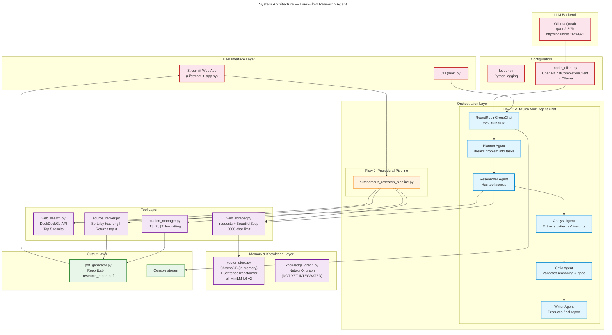
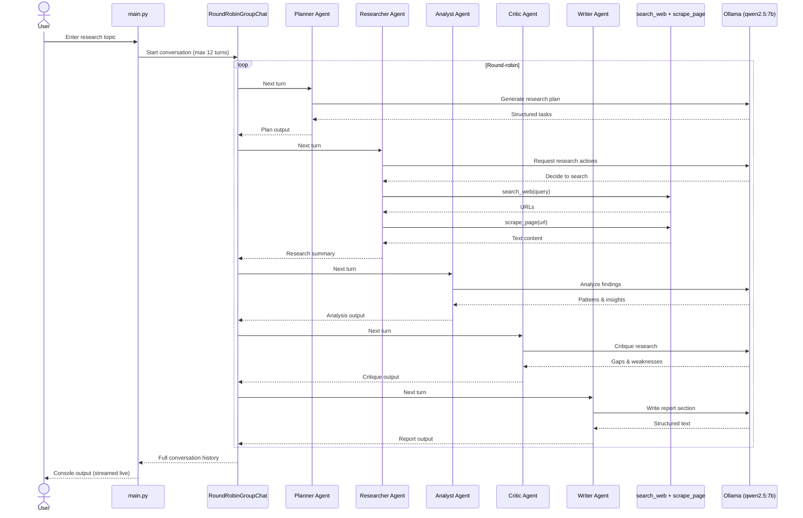
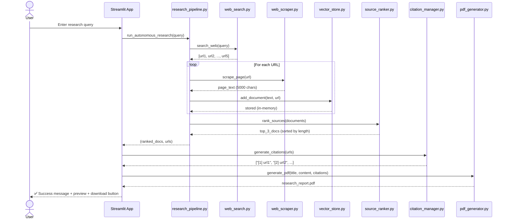
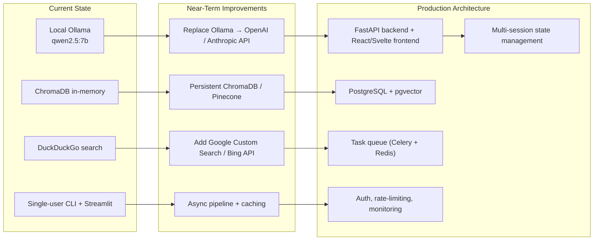

# Architecture Diagram — Autonomous Deep Research AI Agent

---

## Data Flow Diagrams

### Flow 1: Multi-Agent CLI (AutoGen)

### Flow 2: Web UI Pipeline (Streamlit)

---

## Component Responsibility Matrix

| Component | Technology | Responsibility | Used In |
|---|---|---|---|
| **Planner Agent** | AutoGen + Ollama | Decompose research question into structured subtasks | Flow 1 |
| **Researcher Agent** | AutoGen + Ollama + Tools | Execute web searches and scrape content | Flow 1 |
| **Analyst Agent** | AutoGen + Ollama | Identify patterns, trends, key insights | Flow 1 |
| **Critic Agent** | AutoGen + Ollama | Validate reasoning, flag missing info | Flow 1 |
| **Writer Agent** | AutoGen + Ollama | Synthesize findings into structured report | Flow 1 |
| **Research Pipeline** | Python procedural | Deterministic search→scrape→rank→PDF | Flow 2 |
| **Web Search** | DuckDuckGo (ddgs) | Retrieve top 5 URLs for query | Both |
| **Web Scraper** | requests + BeautifulSoup | Extract text from HTML pages | Both |
| **Source Ranker** | Python (sort by len) | Rank documents, return top 3 | Flow 2 |
| **Vector Store** | ChromaDB + SentenceTransformer | Embed & store documents (in-memory) | Flow 2 |
| **PDF Generator** | ReportLab | Generate downloadable PDF report | Flow 2 |
| **Knowledge Graph** | NetworkX | Construct entity-relation graph (planned) | — |

---

## Key Architectural Decisions

| Decision | Rationale | Trade-off |
|---|---|---|
| **Two independent flows** (AutoGen + pipeline) | Separates LLM-dependent research from deterministic data gathering | Code duplication; maintenance burden |
| **Local-only stack** (Ollama, DuckDuckGo, ChromaDB) | Zero API costs, fully offline capable | Limited to smaller models; search coverage narrower than Bing/Google |
| **In-memory vector store** | Simplicity for demo/portfolio | Data lost on restart; not production-ready |
| **Single-agent tool access** (Researcher only) | Enforces separation of concerns per AutoGen best practices | Other agents cannot verify facts directly |
| **No LLM in Flow 2** | Faster execution; no Ollama dependency for PDF generation | Report is raw scraped text, not a synthesized analysis |

---

## Scaling / Production Roadmap

---

## How to Explain This in a Tech Interview

### 30-Second Elevator Pitch

> *"This is an autonomous deep research system built with Python. It has two architectural modes: a **multi-agent chat** using Microsoft AutoGen where five AI agents collaborate in a round-robin conversation to research a topic, and a **procedural pipeline** served through a Streamlit UI that searches the web, scrapes content into a vector database, ranks sources, and generates a PDF report. The entire stack runs locally using Ollama for LLM inference and DuckDuckGo for search — no API keys needed."*

### 2-Minute Deep Dive

> *"The architecture is split into two independent flows sharing a common tool layer. The **first flow** is a research-grade multi-agent system: five AutoGen agents (Planner, Researcher, Analyst, Critic, Writer) take turns in a RoundRobinGroupChat. Only the Researcher has tool access — it calls `web_search` and `scrape_page` — while the others provide pure LLM reasoning. All agents use the same local Ollama model via an OpenAI-compatible client.*
>
> *"The **second flow** is a deterministic pipeline for the Streamlit UI. When a user submits a query, it searches DuckDuckGo, scrapes each result with BeautifulSoup, embeds and stores the content in an in-memory ChromaDB vector store, ranks the sources by length, and generates a PDF with ReportLab. This flow does not use LLMs — it is purely data gathering and formatting — which makes it fast and reliable but lacks the analytical depth of the agentic flow.*
>
> *"The **tool layer** is shared between both flows and includes web search, scraping, ranking, and citation formatting. The **memory layer** has a ChromaDB vector store and a built but not yet integrated NetworkX knowledge graph. The **config layer** handles logging and LLM client configuration. This modular separation means either flow can be extended independently.*
>
> *"The biggest architectural decision was keeping the two flows separate rather than integrating them. This was intentional — it lets the demo highlight both the AutoGen multi-agent paradigm and a simpler procedural approach, making it more educational as a portfolio project. In production, I would merge them: use the agentic flow for topic understanding and the pipeline for fast data retrieval, with a shared persistent vector store and async task queue."*

### Potential Interview Questions & Answers

| Question | Answer |
|---|---|
| **Why two flows instead of one?** | The project serves dual purposes: the AutoGen flow showcases multi-agent orchestration, while the Streamlit flow provides a fast, interactive demo. In production, I'd refactor both to share a unified orchestration layer. |
| **Why only the Researcher agent has tools?** | This follows the AutoGen principle of separation of concerns — agents specialize in reasoning or action, not both. It also prevents the Critic or Writer from making uncontrolled external calls. |
| **Why DuckDuckGo instead of Google/Bing?** | Zero API cost and no API key requirement. For a portfolio project with local-only requirements, it was the pragmatic choice. There's a clear upgrade path to Google Custom Search or Bing API. |
| **Why is the vector store in-memory?** | Simplicity for demo purposes. The `vector_store.py` module has a clean interface, so swapping to persistent ChromaDB or Pinecone is a single-line change. |
| **No tests — why?** | This is an early-stage demo project. I'd add pytest tests for the pipeline functions, tool modules, and PDF generation before production deployment. |
| **How would you handle errors from web scraping?** | Currently errors are swallowed with a bare `except`. I'd add retry logic with exponential backoff, request timeouts, user-agent rotation, and structured error propagation up the call stack. |
